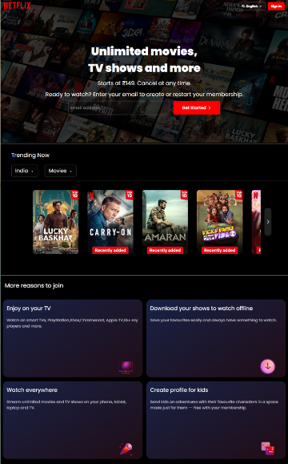
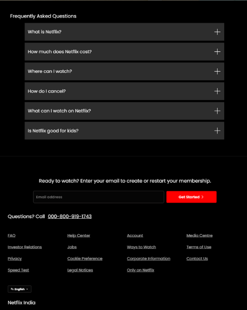

# 🎬 Netflix-UI-Clone  

  
  

## 📌 Project Overview  
This project is a **fully responsive and interactive** clone of the **Netflix website UI**, developed using **HTML, CSS, and JavaScript**. The goal is to replicate the **core design and user experience** of Netflix while continuously improving the project with new features.  

## ✨ Features  
✅ **Responsive UI** – Works on all devices (Mobile, Tablet, Desktop)  
✅ **Smooth Animations** – Hover effects & transitions  
✅ **Dynamic Hero Section** – Styled with CSS & JavaScript  
✅ **Interactive Navbar** – Fully responsive menu & category selection  
✅ **Modern Netflix-like Layout** – CSS Flexbox & Grid for perfect alignment  
✅ **Ongoing Enhancements** – More features will be added soon  

## 🔧 Tech Stack  
- **Frontend:** HTML, CSS, JavaScript  

## 🚀 Upcoming Features  
🔹 **Dark mode & theme customization**  
🔹 **Search bar functionality**  
🔹 **Movie filtering & categorization**  
🔹 **User authentication UI (Login Page)**  

## 📽️ Project Demo  
### 🎥 Watch on YouTube  
[](https://youtu.be/PDNGI0KouzQ)  

## 📂 Installation & Usage  
   Clone this repository:  
   ```bash
   git clone https://github.com/M-Meeran-Siddiqui/Netflix_Clone.git
   ```  
## 🤝 Contributing  
Feel free to fork this repo, make improvements, and submit a pull request!
